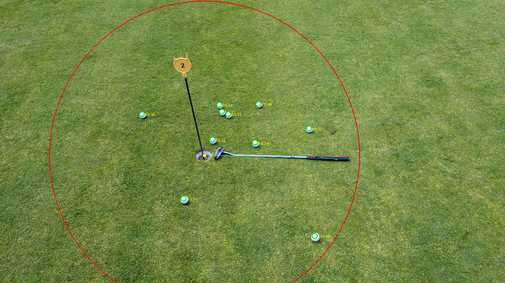

# putt-analyzer

Wertet ein Foto eines Putting-Greens aus — **nicht zum Zählen, sondern für die
Putt-Streuung relativ zur Schläger→Loch-Linie**. Der liegende Putter zeigt vom Loch
in die Richtung, aus der die Bälle kamen. Daraus pro Ball:

- **zu kurz / zu lang** (längs der Putt-Linie) — Loch nicht erreicht vs. überrollt
- **links / rechts** (quer dazu, aus Spielersicht)
- **Wertung:** ≤ 1 m *gut*, 1–3 m *schlecht*, > 3 m *Mist* (Kern beim Putten: Loch
  treffen ODER nah dran)
- **Systematik:** die mittlere Schlagseite (z. B. „tendenziell kurz + rechts")

Findet aktives Loch + Putterrichtung + Bälle automatisch; Maßstab aus der Putterlänge.



### Beispiel-Report (putt1)

```
Loch        : (1635,1240), Cup 139px   Putter 1056px
Baelle      : 10 auf dem Gruen, 0 im Loch

Pro Putt (entlang Schlaeger->Loch-Achse):
 #   Dist         laengs         quer  Wertung
 1  0.11m       5cm kurz      10cm re  gut
 ...
10  0.89m      72cm kurz      52cm li  gut

Zonen       : 10 gut (<=1m) | 0 schlecht (1-3m) | 0 Mist (>3m)
Tendenz     : im Schnitt 19 cm zu kurz, 10 cm rechts
Streuung    : laengs +-33 cm, quer +-27 cm
Systematik  : keine klare Schlagseite
```

Annotiert: grüner 1m-Ring, roter 3m-Ring, cyan Putt-Achse, Bälle nach Zone gefärbt,
magenta Pfeil = mittlere Schlagseite.

## Architektur: „VLM grob + CV fein"

Reine Bildverarbeitung scheitert an realen Fotos (gekippte Putter/Fahnen, zwei
Fahnen, Schatten-Ränder, ein Schuh am Bildrand). Reine VLM-Koordinaten sind zu
ungenau. Die Kombination spielt beide Stärken aus:

1. **VLM (grob)** — ein Vision-Modell liefert aus einem verkleinerten Bild nur
   Semantik: *wo* ist das aktive Loch, *wo* der Putter (zwei Enden), *wie viele*
   Bälle im Loch. Löst die harten Fälle (Rotation, Mehrfach-Fahnen, Distraktoren).
2. **CV (fein)** — numpy/scipy macht die *präzise* Messung: weiße Ball-Blobs exakt
   lokalisieren, Cup-Ellipse lokal nachmessen.
3. **Maßstab aus der Putterlänge** (VLM-Enden, Standard 34″ = 0,864 m). Der Putter
   liegt flach auf dem Grün → direkter Bodenmaßstab in der Ball-Ebene. Querprobe:
   Loch-Durchmesser (Norm 108 mm).

Der VLM-Provider ist **austauschbar** — die CV-Feinmessung macht das Ergebnis
unabhängig von der VLM-Präzision.

## Provider-Wahl (empirisch an 5 Testbildern)

| Provider / Modell | Lokalisierung | Kosten/Foto | Urteil |
|---|---|---|---|
| **`anthropic` / `claude-opus-4-8`** | trifft Loch + Putter zuverlässig | ~1 ct | **Default, empfohlen** |
| `anthropic` / `claude-sonnet-4-6` | gut, überzählt Bälle | ~0,5 ct | ok |
| `anthropic` / `claude-haiku-4-5` | zu schwach (Loch verfehlt) | ~0,2 ct | nein |
| `mistral` / `mistral-large` | zu ungenau (Seed oft weit daneben) | günstig | nein |

## Install & Keys

```bash
cd tools/putt-analyzer
python3 -m venv venv
venv/bin/pip install -r requirements.txt
```

Keys per Umgebungsvariable **oder** `.env` (via `python-decouple`, ab cwd aufwärts gesucht):

```
ANTHROPIC_API_KEY=sk-ant-...
MISTRAL_API_KEY=...        # nur fuer --provider mistral
```

## Nutzung

```bash
venv/bin/python putt_analyze.py putt1.jpg                         # hybrid + Claude Opus (Default)
venv/bin/python putt_analyze.py putt2.jpg --provider mistral      # Mistral statt Claude
venv/bin/python putt_analyze.py putt1.jpg --detector manual --points pts.json   # ohne Modell
```

### Optionen

| Flag | Default | Zweck |
|---|---|---|
| `--detector hybrid\|vlm\|manual\|cv` | `hybrid` | Detektionsverfahren |
| `--provider anthropic\|mistral` | `anthropic` | VLM-Provider |
| `--model NAME` | Provider-Default | VLM-Modell überschreiben |
| `--putter-inch 33\|34\|35` | `34` | angenommene Putterlänge (Maßstab) |
| `--radius M` | `1.0` | Prüfradius in Metern |
| `--save-dir DIR` | — | Bild + Label-JSON ablegen (**Trainingsdaten**, s. u.) |
| `--out datei.png` | `putt_annotated.png` | annotiertes Bild |
| `--hole`,`--putter`,`--cup-roi`,`--putter-roi` | — | nur Detektor `cv` |

### Ergebnis an den 5 Testbildern (hybrid + Opus)

| Bild | Besonderheit | Bälle | Zonen (gut/schlecht/Mist) | Tendenz |
|---|---|---|---|---|
| putt1 | achsparallel | 10 | 10 / 0 / 0 | 19 cm kurz, 10 cm rechts |
| putt2 | **zwei Fahnen**, gekippt | 8 | 5 / 3 / 0 | 84 cm lang, 14 cm links |
| putt3 | 3 Bälle im Loch | 7 | 6 / 1 / 0 | 48 cm lang, 11 cm links |
| putt4 | gekippte Fahne | 6 | 6 / 0 / 0 | 24 cm lang, 9 cm links |
| putt5 | **Schuh** am Rand | 6 | 6 / 0 / 0 | 20 cm lang, 8 cm links |

Aktives Loch in putt2 korrekt = linkes (nicht die 2. Fahne); Schuh in putt5
ausgeschlossen; Bälle im Cup (putt3/4) nicht als Grün gezählt. (putt2-Tendenz durch
die 2.-Loch-Grenze leicht verzerrt — s. *Bekannte Grenzen*.)

## Detektoren

- **`hybrid`** (Default) — VLM grob + CV fein, s. o.
- **`vlm`** — nur die rohen VLM-Punkte, ohne CV-Feinmessung (Debug/Vergleich).
- **`manual`** — Punkte aus JSON (`{"hole":[x,y],"putter":[[hx,hy],[gx,gy]],
  "balls":[[x,y],...],"balls_in_hole":N}`), kein Modell. Zum Testen / Labeln.
- **`cv`** — reine Bildverarbeitung mit festen ROIs für putt1-artige (achsparallele)
  Bilder. Kein Modell, aber nicht rotationsrobust.

## Trainingsdaten sammeln

`--save-dir DIR` legt das Bild **und** ein Label-JSON (Loch, Putter, Maßstab,
Ball-Koordinaten, Zählung) ab — ein wachsender Datensatz, um später ein eigenes,
günstigeres Modell zu trainieren und den VLM-Schritt zu ersetzen.

> **Datenschutz:** User-Bilder nur mit Einwilligung speichern.

## Bekannte Grenzen (Stand jetzt)

- **Ball direkt am Loch** (putt1): ein Ball ~0,1 m vom Cup wird als Grün-Ball
  gezählt, obwohl er visuell „am Loch" liegt. Ob solche Bälle als eingelocht
  gelten, ist eine Produktentscheidung (Schwellwert). Eine feste Meter-Schwelle
  schließt sonst legitime nahe Bälle in anderen Drills aus.
- **Zweite Fahne** (putt2): ein weißes Objekt am zweiten Loch kann als Grün-Ball
  durchgehen. Saubere Lösung = zweite-Fahnen-Erkennung; ein naiver Warm-Blob-Filter
  warf in anderen Bildern echte Bälle weg und wurde verworfen.
- **Ball-Zählung** generell ±1 je nach Bild (CV-Schwellwerte). Loch, Putter und
  Maßstab sind robust.

## Test

```bash
venv/bin/python -m pytest -v          # ohne Key: Geometrie, CV, manual, Blobs
RUN_VLM_TESTS=1 venv/bin/python -m pytest   # zusätzlich Live-Hybrid (kostet 1 API-Call)
```
